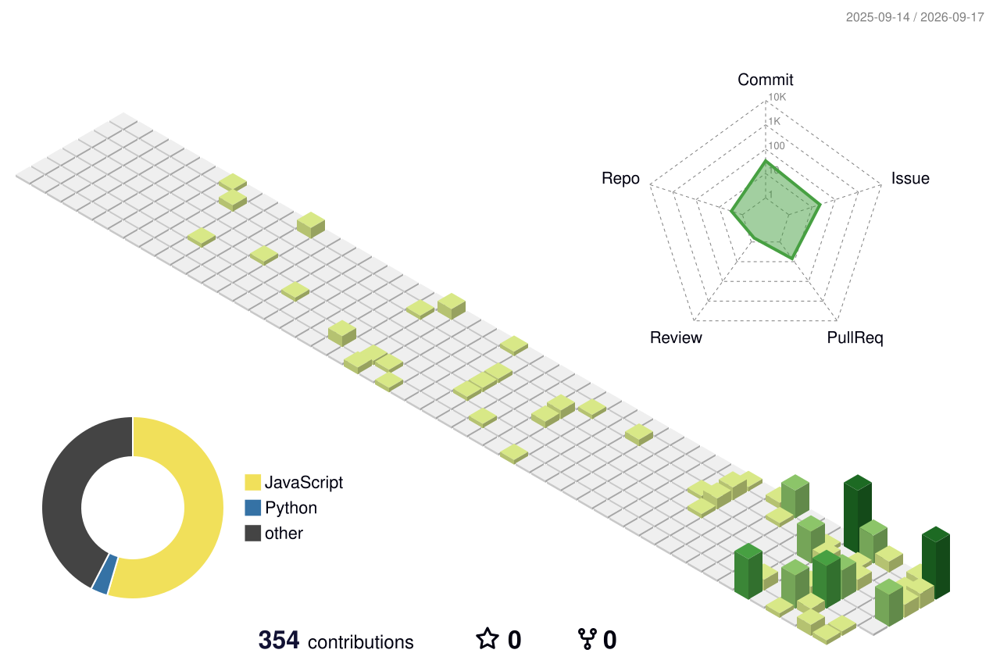

<div align="center">


<br/>


<br/><br/>


</div>

---

## 👨‍💻 Sobre mí

Soy **Dalton**, desarrollador **Full-Stack** enfocado en construir aplicaciones y sistemas que resuelvan problemas reales.

Actualmente trabajo principalmente con **Node.js, TypeScript y React**, mientras profundizo en arquitectura de software, bases de datos, automatización e integración de IA.

```yaml
enfoque:
  - Desarrollo Full-Stack
  - APIs y arquitectura backend
  - Bases de datos
  - Automatización
  - IA aplicada al desarrollo
  - Linux + Docker

objetivo:
  Construir productos sólidos y crecer hacia oportunidades internacionales.
```

---

## ⚙️ Stack

<div align="center">

### Lenguajes


### Backend & Frontend


### Datos & Infraestructura


### Explorando


<br/>

`IA` · `Arquitecturas Multi-Agente`

</div>

---

## 🏗️ Proyectos destacados

| Proyecto                                                       | Descripción                                         | Tecnologías                                        |
| -------------------------------------------------------------- | --------------------------------------------------- | -------------------------------------------------- |
| [**Rifadora**](https://github.com/DaltonARC/Rifadora)          | Plataforma para gestión de rifas y procesos de pago | React · Node.js · TypeScript · PostgreSQL · Prisma |
| [**La Percha**](https://github.com/DaltonARC/la-percha-tienda) | Catálogo online con carrito y pedidos vía Instagram | HTML · CSS · JavaScript                            |
| [**Todo Manager**](https://github.com/DaltonARC/Todo-Manager)  | Gestor de tareas                                    | Python                                             |

---

## 🤖 Actualmente explorando

* Arquitecturas multi-agente
* IA aplicada al desarrollo de software
* Automatización con **n8n**
* Modelos locales con **Ollama**
* Docker y self-hosting
* Arquitectura backend

---

## 📊 GitHub

<div align="center">



<br/><br/>



<br/><br/>

<picture>
  <source media="(prefers-color-scheme: dark)" srcset="https://streak-stats.demolab.com?user=DaltonARC&theme=dark&hide_border=true" />
  
</picture>

<br/><br/>


</div>

---

## 🧊 Calendario de contribuciones en 3D

<div align="center">

<picture>
  <source media="(prefers-color-scheme: dark)" srcset="./profile-3d-contrib/profile-night-green.svg" />
  
</picture>

</div>

---

## 📌 Actividad reciente

<!--START_SECTION:activity-->
<!--END_SECTION:activity-->

<sub>Esta lista se actualiza sola cada 30 minutos con mis últimos eventos públicos en GitHub.</sub>

---

## 📈 Métricas avanzadas

<div align="center">


</div>

<sub>Calendario de actividad, lenguajes y hábitos de código, generados automáticamente cada día.</sub>

---

## 🎯 Hacia dónde voy

Construir experiencia sólida mediante **proyectos reales**, mejorar continuamente mis fundamentos de ingeniería de software y desarrollar un perfil preparado para trabajar en **equipos y proyectos internacionales**.

---

<div align="center">

### Construyendo · Aprendiendo · Iterando

<br/>


<br/><br/>


</div>
